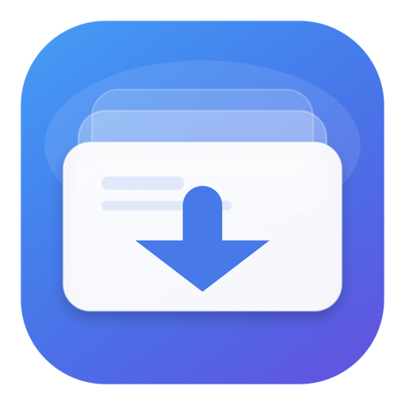

# FetchDeck

<p align="center">
  
</p>

**A native, private download manager for the media you are allowed to save.**

[](https://github.com/thekeyvan/fetchdeck/releases/latest)
[](https://github.com/thekeyvan/fetchdeck/actions/workflows/ci.yml)
[](LICENSE)

FetchDeck is an open-source SwiftUI download manager for macOS. Paste a media
URL, inspect it, choose the quality, and add it to a persistent queue. Everything
runs locally; there is no FetchDeck account, cloud service, tracking, or
advertising.

[Download the latest notarized DMG](https://github.com/thekeyvan/fetchdeck/releases/latest)

## Highlights

- Supports the broad site catalog provided by yt-dlp, including YouTube, Vimeo,
  Twitch, TikTok, X/Twitter, SoundCloud, podcast hosts, news players, and many
  embedded media players.
- Downloads individual items, playlists, and collections.
- Offers Best, 4K, 1440p, 1080p, 720p, and 480p video recipes.
- Extracts original audio or creates MP3, M4A, and FLAC files.
- Runs 1–8 simultaneous jobs with queue pause, reordering, cancellation, retry,
  duplicate protection, and resumable transfers.
- Supports bandwidth limits, fragment concurrency, automatic retries, metadata,
  artwork, subtitles, and optional SponsorBlock processing.
- Uses an existing Safari, Chrome, Firefox, Brave, Edge, Chromium, or Vivaldi
  session for media available through an account you control.
- Keeps history, credentials choices, logs, and downloaded files on your Mac.
- Bundles universal Apple Silicon and Intel builds of yt-dlp, FFmpeg, ffprobe,
  and Node.js. Recipients do not need Homebrew or terminal setup.

## Install

1. Download `FetchDeck.dmg` from the
   [latest release](https://github.com/thekeyvan/fetchdeck/releases/latest).
2. Open the disk image.
3. Drag **FetchDeck** into **Applications**.

Official release artifacts are signed with a Developer ID certificate,
notarized by Apple, and compatible with macOS 13 or newer.

The default destination is `~/Movies/FetchDeck Downloads`. You can change it in
Settings.

## Signed-in media

Choose the browser where you are already signed into the source site under
**Settings → Signed-in browser access**. FetchDeck passes that browser choice
directly to yt-dlp for link analysis and downloading. It never asks for or
stores your password.

Safari may require Full Disk Access before another process can read its cookie
database. FetchDeck links directly to the relevant macOS privacy setting. A
Netscape-format `cookies.txt` file is also supported; treat such a file like a
password.

## Build from source

Requirements:

- macOS 13 or newer
- Xcode with the macOS SDK
- Command Line Tools

```sh
git clone https://github.com/thekeyvan/fetchdeck.git
cd fetchdeck
./mac-app/build-app.sh
```

The first build downloads checksum-pinned runtime sources and binaries. FFmpeg
and LAME are built from source for both Apple Silicon and Intel. The local app
is written to:

```text
dist/FetchDeck.app
```

Run the native tests directly with:

```sh
swift test --package-path mac-app
```

See [DISTRIBUTION.md](DISTRIBUTION.md) for Developer ID signing and
notarization.

## Architecture

FetchDeck passes structured arguments directly to packaged yt-dlp processes;
URLs never pass through a shell. Each active job owns an isolated process,
progress parser, and error state. A scheduler fills the configured concurrency
slots while preserving queued work and active transfers. Download recipes are
snapshotted into jobs, so later settings changes do not mutate existing work.

Queue history is stored in Application Support. Media files and yt-dlp archive
files stay in the chosen destination.

## Responsible use

FetchDeck is a general-purpose client for downloading media you own, media you
created, public-domain material, and content you otherwise have permission to
save. You are responsible for complying with copyright law and each service's
terms.

## Contributing

Bug reports and focused pull requests are welcome. Read
[CONTRIBUTING.md](CONTRIBUTING.md) before submitting changes. Please report
security concerns according to [SECURITY.md](SECURITY.md).

## License

FetchDeck's original source is available under the [MIT License](LICENSE).
Bundled tools retain their own licenses. Exact notices, source archives, and
reproducible build recipes are included with release builds and documented in
[third-party](third-party).
